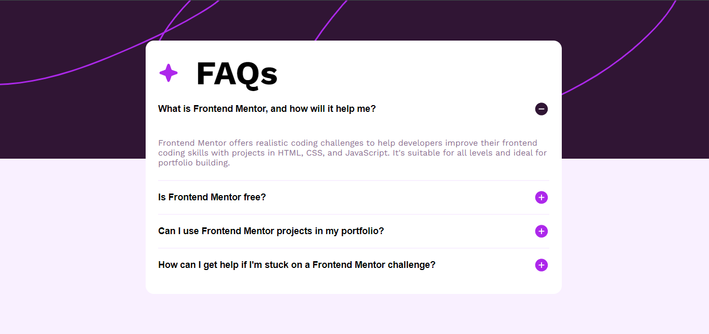

# Frontend Mentor - FAQ accordion solution

This is a solution to the [FAQ accordion challenge on Frontend Mentor](https://www.frontendmentor.io/challenges/faq-accordion-wyfFdeBwBz). Frontend Mentor challenges help you improve your coding skills by building realistic projects. 

## Table of contents

- [Overview](#overview)
  - [The challenge](#the-challenge)
  - [Screenshot](#screenshot)
  - [Links](#links)
- [My process](#my-process)
  - [Built with](#built-with)
  - [What I learned](#what-i-learned)
  - [Continued development](#continued-development)
  - [Useful resources](#useful-resources)
- [Author](#author)
- [Acknowledgments](#acknowledgments)

## Overview

### The challenge

Users should be able to:

- Hide/Show the answer to a question when the question is clicked
- Navigate the questions and hide/show answers using keyboard navigation alone
- View the optimal layout for the interface depending on their device's screen size
- See hover and focus states for all interactive elements on the page

### Screenshot

](./screenshot.jpg)

### Links

- Solution URL: [Link](https://github.com/MrUnAnonymous/faq-accordion-solution)
- Live Site URL: [Link](https://faq-accordion-solution.vercel.app/)

## My process

- Wrote the HTML part
- Gave it CSS styling
- Wrote JS file 
- Changed HTML & CSS part after watching a YT video

### Built with

- Semantic HTML5 markup
- CSS custom properties
- Flexbox

### What I learned

- I learned a new and effective way of writing CSS
- I learned how to make perfect choices in terms of your arrangement of the HTML tags to make it    easier to style and work

### Continued development

I would love to challenge myself and try to find answers like this project made me do. I had to start looking for an answer cause I couldn't reflect the functionalty on all 4 list elements which is when I stumbled across edsHTML who came in clutch help me fix my minor CSS issues and JS file.

## Author

- Frontend Mentor - [Saurabh-Sapkal](https://www.frontendmentor.io/profile/MrUnAnonymous)

## Acknowledgments

Thank you edsHTML YT channel for the final push of help I was really stuck on the hide and show the content part
